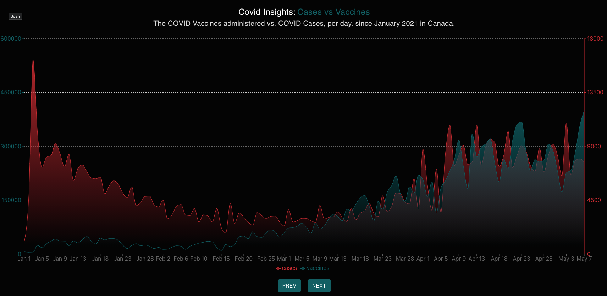
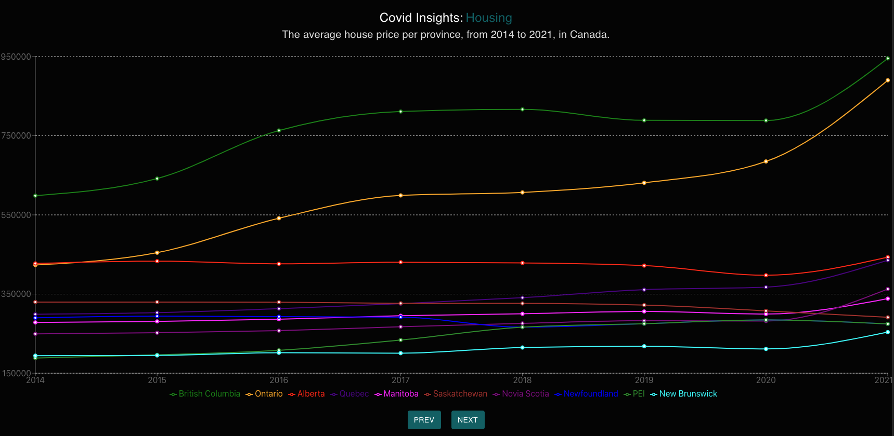

# Description

This project was created for the Kinaxis Full-Stack devleper take home project. The application is a data visualization tool for COVID Cases vs Vaccines & Housing market prices for the last 7 years. 
    
* The data under `test-data/api-data.json` is an example of the data & format returned by the AWS Lambda
## Project Setup

Run the following commands in the project directory:

### `npm i`
### `npm start`

Runs the app in the development mode.\
Open [http://localhost:3000](http://localhost:3000) to view it in the browser.

## Project Testing
### `npm test`

Launches the test runner in the interactive watch mode.\

# Sources for the visualization data:

Housing Market Data: `https://wowa.ca/reports/canada-housing-market`\
COVID Data: `https://ourworldindata.org/ `

# Application:

